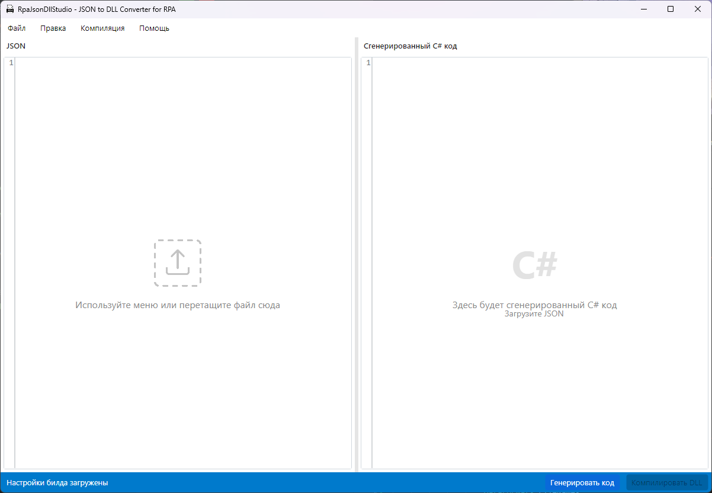
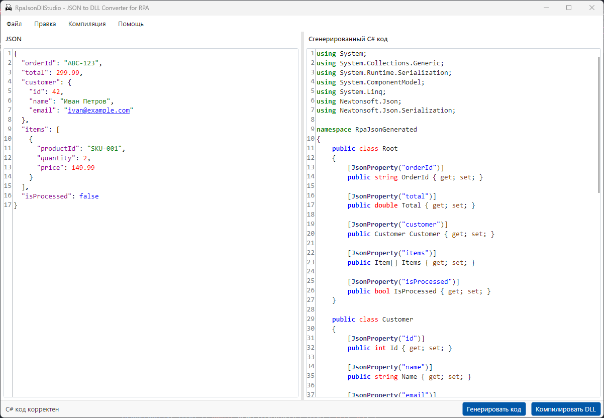
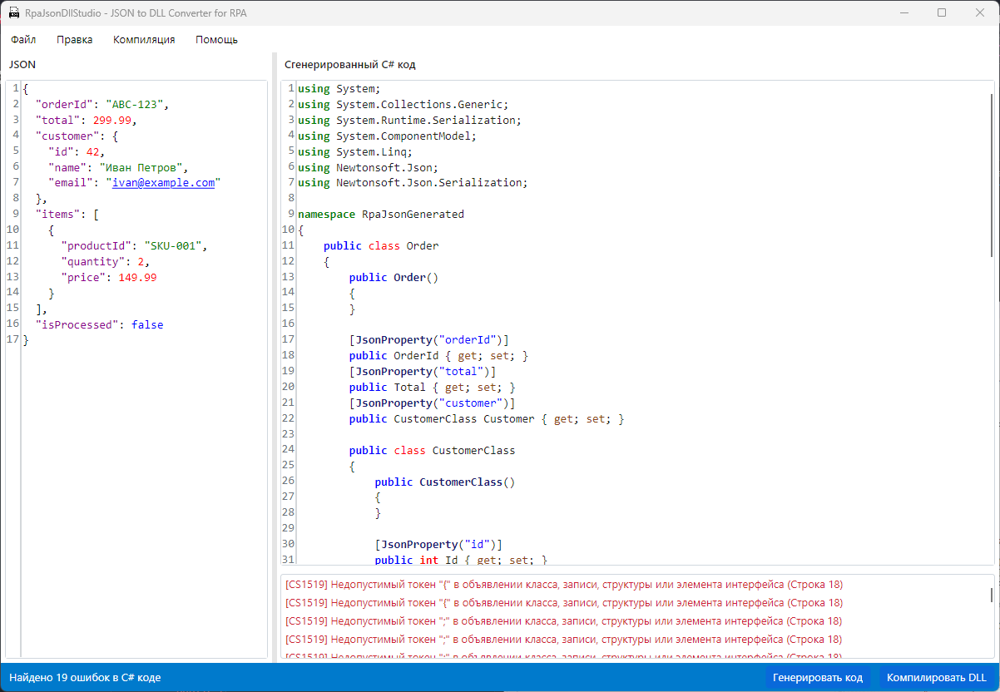

# RpaJsonDllStudio

<div align="center">


[](LICENSE)
[](https://dotnet.microsoft.com/en-us/)
[](https://avaloniaui.net/)

**Автоматическая генерация типизированных DLL из JSON для PIX RPA, Primo и UIPath**

[Возможности](#возможности) • 
[Установка](#установка) • 
[Быстрый старт](#быстрый-старт) • 
[Технологии](#технологии) • 
[Разработка](#разработка)

</div>

## 📋 Содержание
- [Зачем это нужно](#зачем-это-нужно)
- [Возможности](#возможности)
- [Системные требования](#системные-требования)
- [Установка](#установка)
- [Быстрый старт](#быстрый-старт)
- [Примеры использования](#примеры-использования)
- [Технологии](#технологии)
- [Структура проекта](#структура-проекта)
- [Разработка](#разработка)
- [Вклад в проект](#вклад-в-проект)
- [Лицензия](#лицензия)

## 🎯 Зачем это нужно

В платформах RPA, таких как PIX RPA, Primo и UIPath, нельзя использовать динамическое создание объектов во время выполнения, что существенно усложняет работу с JSON-данными. Единственные доступные способы работы с JSON в этих платформах — это использование специальных активностей по типу "Парсинг JSON" или "Получить свойство JSON", которые преобразуют строку в `System.Text.Json.JsonElement`, с которым приходится работать через Xpath и обращения к элементам.

Это создает следующие проблемы:
- Неудобный доступ к вложенным данным
- Объекты типа `System.Text.Json.JsonElement` не отображаются корректно в отладке
- Сложные JSON-структуры требуют отдельной отладки в IDE
- Невозможность использовать автодополнение и типизацию
- Повышенный риск ошибок при обращении к свойствам JSON

**RpaJsonDllStudio** решает эти проблемы, автоматически превращая любую JSON-структуру в скомпилированную DLL с типизированными классами, которые можно сразу использовать в вашем RPA-проекте. С типизированными классами вы получаете:

- Удобный доступ к данным через свойства объектов
- Полноценное отображение в отладчике
- Поддержку автодополнения в среде разработки
- Безопасную типизацию и проверку на этапе компиляции
- Значительное ускорение разработки и уменьшение количества ошибок

## ✨ Возможности

- **Анализ JSON структуры**:
  - Обработка вложенных объектов любой глубины
  - Поддержка массивов и коллекций
  - Автоопределение типов данных
  - Совместимость с форматами JSON, которые используются в PIX RPA, Primo и UIPath

- **Генерация типизированных C# классов**:
  - Атрибуты для корректной десериализации
  - PascalCase именование для соответствия C# стандартам
  - XML-документация для IDE-подсказок
  - Возможность задать имя корневого класса
  - Оптимизировано для интеграции с RPA-платформами

- **Компиляция кода в DLL**:
  - Поддержка .NET Framework 4.8 (для UIPath)
  - Поддержка .NET Standard 2.0 (для PIX RPA и Primo)
  - Оптимизация выходного кода
  - Встроенная валидация с понятными сообщениями об ошибках

- **Гибкость ввода**:
  - Загрузка из файлов
  - Получение из URL-источников (API, веб-сервисы)
  - Копирование-вставка JSON из буфера обмена
  - Drag-and-drop файлов JSON непосредственно в редактор

- **Автоматическая очистка JSON**:
  - Удаление HTML-сущностей (`&nbsp;`, `&quot;`, `&amp;`, и др.) при генерации C# кода
  - Устранение проблем с пробелами и специальными символами без модификации исходного JSON
  - Подготовка JSON-данных, полученных из веб-источников, для создания корректных C# классов
  - Предотвращение ошибок парсинга из-за неправильно отформатированного JSON

- **Гибкие настройки**:
  - Выбор фреймворка под конкретную RPA-платформу
  - Библиотека JSON (Newtonsoft.Json, System.Text.Json)
  - Пользовательские namespace и именование классов
  - Настройка имени корневого класса для лучшей интеграции с вашей моделью данных

- **Удобный пользовательский интерфейс**:
  - Визуальные подсказки для пустых редакторов
  - Редакторы кода с подсветкой синтаксиса и нумерацией строк
  - Настраиваемый интерфейс с разделителем между панелями
  - Регулируемый размер панели с ошибками компиляции
  - Высокая контрастность для улучшенной читаемости кода
  - Оптимизированные размеры окна для комфортной работы с JSON файлами

- **Производительность и надежность**:
  - Оптимизированные логи (вывод только в режиме отладки)
  - Правильная обработка кодировки текста (UTF-8)
  - Стабильная работа с файлами любого размера
  - Уменьшенный размер исполняемого файла

## 💻 Системные требования

- ОС: Windows, macOS или Linux
- Среда выполнения: .NET 9.0
- Для компиляции DLL:
  - Для .NET Framework 4.8 DLL: требуется установленный .NET Framework 4.8 на Windows
  - Для .NET Standard 2.0/2.1 DLL: отдельных требований нет (совместимость обеспечивается платформой приложения)
- Дисковое пространство: не менее 100 МБ
- ОЗУ:
  - Для самого приложения: ~100 МБ
  - Рекомендуемые требования к системе: 2 ГБ или более (для комфортной работы с ОС)
- Рекомендуемое разрешение экрана: от 1280×800

> **Примечание:** Само приложение потребляет не более 100 МБ оперативной памяти, но для комфортной работы с IDE и RPA-платформами рекомендуется иметь не менее 2 ГБ ОЗУ в системе. При работе со сложными JSON-структурами или при частой компиляции потребление может незначительно увеличиваться.

## Требования к SDK

Для компиляции DLL в определенный целевой фреймворк:

- **.NET Framework 4.8**: Требуется установленный .NET Framework 4.8 на Windows
- **.NET Standard 2.0/2.1**: Специальных требований нет. Возможность компиляции обеспечивается самим приложением

Приложение автоматически проверяет наличие .NET Framework 4.8 при выборе этой платформы и уведомит вас, если он не установлен.

Вы можете загрузить .NET Framework 4.8 с [официального сайта Microsoft](https://dotnet.microsoft.com/download/dotnet-framework).

## 📥 Установка

### Windows

1. Скачайте последний релиз установщика для Windows из раздела [Releases](https://github.com/themrdjek/RpaJsonDllStudio/releases)
2. Запустите скачанный файл установщика `RpaJsonDllStudio_Windows_Setup_v1.0.0.exe`
3. Следуйте инструкциям мастера установки
4. После завершения установки приложение будет доступно в меню "Пуск"

**Примечание**: Установщик автоматически проверяет наличие .NET 9.0 (Runtime или SDK) и предложит скачать его, если он не установлен. Можно пропустить эту проверку, запустив установщик с параметром `/SKIPDOTNETCHECK`.

### macOS и Linux

Установщики для macOS и Linux находятся в разработке. 

**Временное решение**: Вы можете запустить приложение на этих платформах, загрузив исходный код и собрав его вручную согласно инструкциям в разделе [Разработка](#разработка).

### Технические детали

Для создания Windows-инсталлятора используется [Inno Setup](https://jrsoftware.org/isinfo.php) - бесплатный инструмент для создания профессиональных установщиков для Windows. Установщик включает:
- Проверку системных требований (Windows 10 или новее)
- Проверку наличия .NET 9.0 (Runtime или SDK)
- Создание ярлыков в меню "Пуск" и на рабочем столе (опционально)
- Возможность запуска приложения сразу после установки

## 🚀 Быстрый старт

1. **Запустите RpaJsonDllStudio**
   - При запуске вы увидите интерфейс с двумя панелями: для JSON (слева) и C# кода (справа)
   - Визуальные индикаторы подсказывают, что нужно сделать с пустыми панелями

2. **Введите или загрузите JSON** в левую панель редактора:
   - Откройте JSON файл через меню "Файл" → "Открыть JSON..."
   - Загрузите JSON с URL через меню "Файл" → "Загрузить из URL..." (например, из API вашей системы)
   - Вставьте JSON из буфера обмена ("Правка" → "Вставить JSON")
   - Просто перетащите JSON файл из проводника в окно приложения

3. **Нажмите «Генерировать код»** для создания C# классов (правая панель)
   - Проверьте сгенерированный код - он должен соответствовать структуре вашего JSON
   - Обратите внимание на имена классов и их свойства

4. **Настройте параметры компиляции** через меню «Компиляция» → «Настройки компиляции»
   - Выберите целевую платформу:
     - Для PIX RPA: .NET Standard 2.0
     - Для Primo: .NET Standard 2.0 или .NET Framework 4.8
     - Для UIPath: .NET Framework 4.8
   - Задайте имя корневого класса (по умолчанию "Root") - например, "Order", "Customer" и т.д.
   - Укажите namespace (по умолчанию "RpaJsonModels")
   - Выберите библиотеку JSON (рекомендуется Newtonsoft.Json, в PIX используется System.Text.Json) 

5. **Нажмите «Компилировать DLL»** и выберите путь сохранения

6. **Подключите созданную DLL к вашему RPA-проекту**:
   - **В PIX RPA**: добавьте DLL через "Ссылки" → "Добавить ссылку"
   - **В Primo**: импортируйте DLL через "Библиотеки" → "Добавить библиотеку"
   - **В UIPath**: добавьте DLL через "Управление пакетами" → "Добавить локальный пакет"

7. **Используйте сгенерированные классы в своем проекте**:
   ```csharp
   // Десериализация JSON в типизированный объект
   var jsonData = File.ReadAllText("data.json");
   var typedObject = JsonConvert.DeserializeObject<RpaJsonModels.YourRootClass>(jsonData);
   
   // Теперь у вас есть доступ к полям через свойства объекта
   Console.WriteLine(typedObject.SomeProperty);
   ```

## 📋 Примеры использования

### Исходный JSON
```json
{
  "orderId": "ABC-123",
  "total": 299.99,
  "customer": {
    "id": 42,
    "name": "Иван Петров",
    "email": "ivan@example.com"
  },
  "items": [
    {
      "productId": "SKU-001",
      "quantity": 2,
      "price": 149.99
    }
  ],
  "isProcessed": false
}
```

### Получаемые C# классы
```csharp
namespace RpaJsonModels
{
    public class Order // Вместо стандартного "Root" можно задать более подходящее имя
    {
        [JsonProperty("orderId")] public string OrderId { get; set; }
        [JsonProperty("total")] public double Total { get; set; }
        [JsonProperty("customer")] public Customer Customer { get; set; }
        [JsonProperty("items")] public Item[] Items { get; set; }
        [JsonProperty("isProcessed")] public bool IsProcessed { get; set; }
    }

    public class Customer
    {
        [JsonProperty("id")] public int Id { get; set; }
        [JsonProperty("name")] public string Name { get; set; }
        [JsonProperty("email")] public string Email { get; set; }
    }

    public class Item
    {
        [JsonProperty("productId")] public string ProductId { get; set; }
        [JsonProperty("quantity")] public int Quantity { get; set; }
        [JsonProperty("price")] public double Price { get; set; }
    }
}
```

### Использование в RPA

#### Обычный подход (без типизации)
```csharp
// UIPath пример с активностью "Парсинг JSON"
var jsonString = File.ReadAllText("data.json");
var jsonElement = JsonConvert.DeserializeObject<JObject>(jsonString);

// Сложный и неудобный доступ к данным
var orderId = jsonElement["orderId"].ToString();
var customerName = jsonElement["customer"]["name"].ToString();
var firstItemPrice = jsonElement["items"][0]["price"].Value<double>();

// Невозможно увидеть полную структуру в отладчике
// Нет автодополнения, высокий риск опечаток и ошибок
```

#### С использованием RpaJsonDllStudio
```csharp
// UIPath/PIX RPA/Primo пример с типизированными классами
var jsonString = File.ReadAllText("data.json");
var order = JsonConvert.DeserializeObject<RpaJsonModels.Order>(jsonString);

// Типизированный доступ с автодополнением и проверкой на этапе компиляции
Console.WriteLine($"Заказ: {order.OrderId}, Клиент: {order.Customer.Name}");
foreach(var item in order.Items) {
    Console.WriteLine($"Товар: {item.ProductId}, Кол-во: {item.Quantity}");
}

// Полноценное отображение в отладчике
// Безопасность типов, отсутствие ошибок преобразования
```

### Интерфейс приложения



Интерфейс приложения оптимизирован для комфортной работы:
- Окно имеет размер 1200×800 пикселей, что позволяет видеть весь JSON файл средней длины
- Панель JSON позволяет легко загружать файлы через drag & drop
- Редакторы кода оснащены подсветкой синтаксиса и номерами строк
- Панели можно изменять в размере с помощью разделителя
- Панель с ошибками компиляции имеет регулируемую высоту, что позволяет просмотреть детально все ошибки
- Визуальные подсказки в пустых панелях редактора

#### Успешная генерация C# кода



При успешной загрузке JSON и генерации кода:
- Статусная строка показывает, что "C# код корректен"
- Сгенерированный код полностью соответствует структуре JSON
- Кнопка "Компилировать DLL" становится активной
- Все классы и свойства правильно типизированы

#### Обнаружение ошибок в коде



Приложение автоматически проверяет сгенерированный C# код:
- При обнаружении ошибок показывается панель с детальным списком проблем
- Каждая ошибка содержит номер строки и описание проблемы
- Статусная строка показывает количество найденных ошибок
- Кнопка "Компилировать DLL" становится недоступной до исправления ошибок
- В примере показаны типичные ошибки синтаксиса C#, которые блокируют компиляцию

### Функция Drag & Drop

Приложение поддерживает перетаскивание файлов:
- Перетащите JSON файл прямо в окно приложения
- При загрузке файла автоматически генерируется C# код
- Поддерживаются форматы JSON (.json) и TXT (.txt)

### Очистка HTML-сущностей

RpaJsonDllStudio автоматически очищает загруженный JSON от HTML-сущностей при генерации C# кода, сохраняя исходный JSON без изменений:
- Замена `&nbsp;` на обычные пробелы
- Замена `&quot;` на кавычки (`"`)
- Замена `&amp;` на амперсанд (`&`)
- Замена `&lt;` и `&gt;` на < и > соответственно
- Замена `&apos;` на апостроф (`'`)

Приложение использует два разных метода очистки HTML-сущностей:
1. **Очистка при загрузке данных**: Метод `CleanJsonFromHtmlEntities` применяется для обработки данных при загрузке из файла, URL или буфера обмена. Этот метод сохраняет структуру JSON и преобразует только HTML-сущности.
2. **Очистка при генерации имен свойств**: Метод `CleanupPropertyName` используется во время генерации C# классов для создания корректных имен свойств без недопустимых символов, заменяя HTML-сущности и другие проблемные символы.

Это особенно полезно при работе с JSON, полученным из веб-источников, где такие замены часто приводят к проблемам при парсинге. Важно отметить, что исходный JSON в левой панели редактора остается без изменений, очистка применяется только к данным, используемым для генерации C# классов.

### Настройки компиляции


В диалоге настроек компиляции вы можете указать:
- Целевой фреймворк (.NET Standard, .NET Core и т.д.)
  - **Для PIX RPA**: рекомендуется .NET Standard 2.0
  - **Для Primo**: рекомендуется .NET Standard 2.0 или .NET Framework 4.8
  - **Для UIPath**: поддерживается .NET Framework 4.8
  - **Важно**: для компиляции DLL под выбранный фреймворк соответствующий SDK должен быть установлен на вашем компьютере
  - Приложение проверит наличие SDK и предупредит, если нужный SDK не установлен
- Библиотеку JSON для работы:
  - **Newtonsoft.Json** (рекомендуется для всех платформ)
  - **System.Text.Json** (для новых версий PIX RPA и UIPath)
- Пространство имен для классов (по умолчанию: RpaJsonModels)
- **Имя корневого класса** — для лучшей читаемости и интеграции с вашим проектом
- Различные опции форматирования и оптимизации кода

### Режим отладки

Приложение поддерживает запуск в режиме отладки:
- Запустите с параметром командной строки `--debug` или `-d`
- Логи будут выводиться с более детальной информацией
- Полезно при разработке или отладке сложных JSON-структур

В обычном режиме (без флага отладки) приложение работает более оптимально и выводит только критические сообщения.

### Удобный интерфейс работы с ошибками

RpaJsonDllStudio обеспечивает удобную работу с ошибками компиляции:

- **Регулируемый размер панели с ошибками**: Вы можете изменять высоту панели с ошибками с помощью разделителя, появляющегося при наличии ошибок. Это особенно полезно при работе со сложными JSON-структурами, когда компилятор может выдавать множество ошибок.

- **Детальная информация**: Каждая ошибка содержит информацию о строке кода, характере проблемы и возможных способах её устранения.

- **Мгновенная валидация**: C# код автоматически проверяется на наличие ошибок в реальном времени, что позволяет быстро выявлять и исправлять проблемы.

- **Интеграция с рабочим процессом**: Кнопка компиляции DLL автоматически отключается, если в коде присутствуют ошибки, предотвращая создание некорректных библиотек.

Эти возможности особенно важны для RPA-разработчиков, которым необходимо быстро создавать и интегрировать типизированные модели данных в свои проекты PIX RPA, Primo и UIPath.

## 🔧 Технологии

- **[.NET 9.0](https://dotnet.microsoft.com/)** - Основной фреймворк
- **[Avalonia UI](https://avaloniaui.net/)** - Кроссплатформенный UI фреймворк
- **[Roslyn](https://github.com/dotnet/roslyn)** - Компилятор C#
- **[Newtonsoft.Json](https://www.newtonsoft.com/json)** - Библиотека для работы с JSON
- **[AvaloniaEdit](https://github.com/AvaloniaUI/AvaloniaEdit)** - Редактор кода
- **[ReactiveUI](https://reactiveui.net/)** - MVVM фреймворк
- **[Serilog](https://serilog.net/)** - Структурированное логирование

## 📂 Структура проекта

```
RpaJsonDllStudio/
├── src/
│   └── RpaJsonDllStudio/          # Основной проект
│       ├── Assets/                # Ресурсы приложения
│       │   ├── AppResources.axaml # Основные ресурсы (цвета, размеры, шрифты)
│       │   ├── AppStyles.axaml    # Стили элементов интерфейса
│       │   ├── DropFileIcon.png   # Иконка перетаскивания файлов
│       │   └── app-icon.ico       # Иконка приложения
│       ├── Converters/            # Конвертеры для XAML привязок
│       ├── Models/                # Модели данных
│       ├── Services/              # Сервисы для генерации кода и компиляции
│       ├── ViewModels/            # ViewModel-классы для MVVM
│       ├── Views/                 # XAML и code-behind для интерфейса
│       └── App.axaml              # Точка входа приложения
├── common/                        # Общие компоненты
├── tests/                         # Юнит и интеграционные тесты
├── RpaJsonDllStudio.sln           # Решение для Visual Studio
└── README.md                      # Этот файл
```

## 💻 Разработка

### Сборка из исходного кода

```bash
# Клонирование репозитория
git clone https://github.com/themrdjek/RpaJsonDllStudio.git
cd RpaJsonDllStudio

# Установка зависимостей
dotnet restore

# Сборка проекта
dotnet build

# Запуск приложения
dotnet run --project src/RpaJsonDllStudio/RpaJsonDllStudio.csproj

# Запуск приложения в режиме отладки
dotnet run --project src/RpaJsonDllStudio/RpaJsonDllStudio.csproj -- --debug
```

### Создание установщика

Для Windows используется Inno Setup для создания профессионального установщика:

```bash
# 1. Сначала соберите приложение для Windows
dotnet publish src/RpaJsonDllStudio/RpaJsonDllStudio.csproj -c Release -r win-x64 --self-contained

# 2. Скомпилируйте установщик с помощью Inno Setup
# Установите Inno Setup: https://jrsoftware.org/isdl.php
# Откройте файл installers/windows/setup_windows.iss в Inno Setup Compiler
# и нажмите Build -> Compile или F9
```

Исходный код установщика находится в папке `installers/windows/` и может быть адаптирован под ваши нужды.

Установщики для macOS и Linux находятся в разработке и будут доступны в будущих релизах.

### Требования для разработки

- .NET 9.0 SDK
- Visual Studio 2022, JetBrains Rider или VS Code

## 🤝 Вклад в проект

Мы приветствуем вклад в развитие проекта! Если вы хотите помочь:

1. Создайте fork репозитория
2. Создайте ветку для вашей функции (`git checkout -b feature/amazing-feature`)
3. Внесите изменения и сделайте коммит (`git commit -m 'Add amazing feature'`)
4. Отправьте изменения в ваш fork (`git push origin feature/amazing-feature`)
5. Откройте Pull Request в основной репозиторий

## 📄 Лицензия

Проект распространяется под [лицензией MIT](LICENSE). Используйте его свободно в личных и коммерческих проектах.

---

<div align="center">
<b>RpaJsonDllStudio</b> создан с 💙 для RPA-разработчиков

Есть вопросы или предложения? [Откройте issue](https://github.com/themrdjek/RpaJsonDllStudio/issues/new)
</div>
